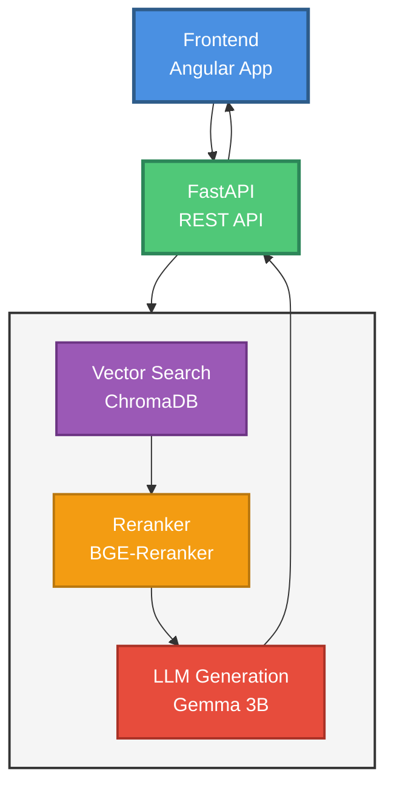
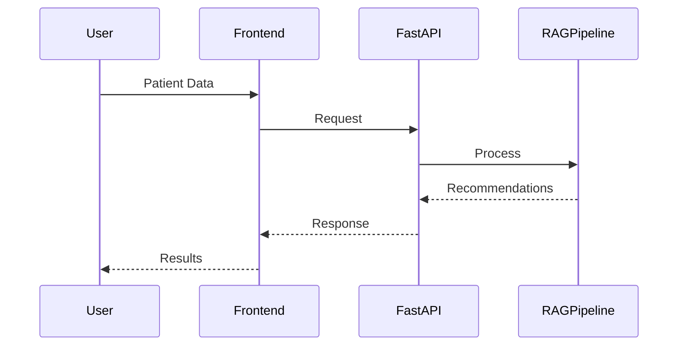

# Diabetes RAG Application - High-Level Flow

## Sequence Diagram

## Flow Description

1. **Frontend**: User submits patient data
2. **FastAPI**: Receives request and orchestrates RAG pipeline
3. **RAG Pipeline**:
   - **Vector Search**: Retrieves relevant documents from ChromaDB
   - **Reranker**: Improves document relevance (optional)
   - **LLM**: Generates personalized recommendations
4. **FastAPI**: Returns structured response
5. **Frontend**: Displays recommendations to user  

