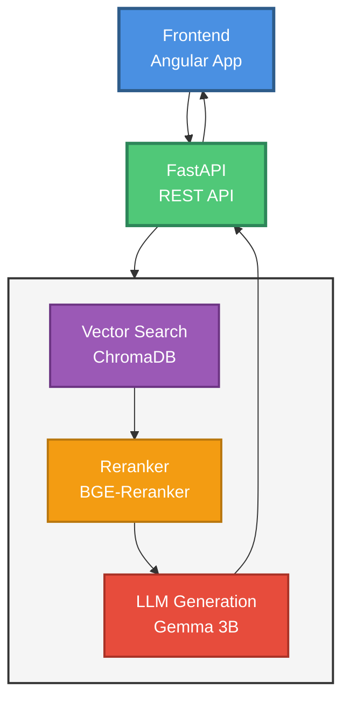
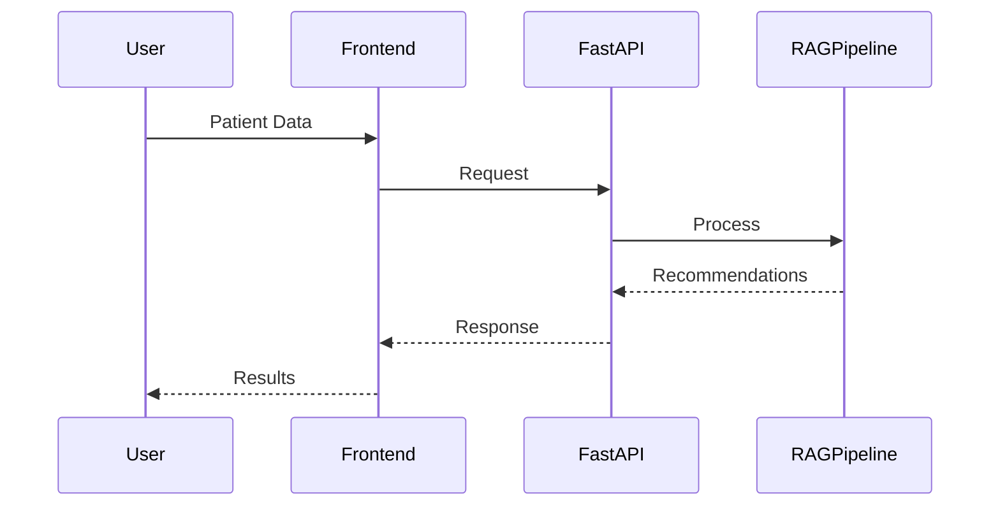
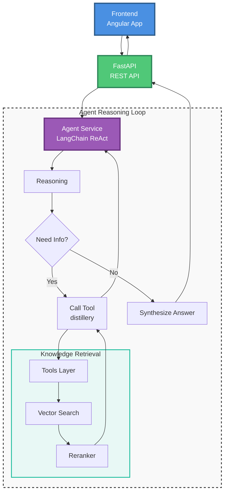

# Diabetes RAG Application - High-Level Flow

## Sequence Diagram

## Flow Description

1. **Frontend**: User submits patient data
2. **FastAPI**: Receives request and orchestrates RAG pipeline
3. **RAG Pipeline**:
   - **Vector Search**: Retrieves relevant documents from ChromaDB
   - **Reranker**: Improves document relevance (optional)
   - **LLM**: Generates personalized recommendations
4. **FastAPI**: Returns structured response
5. **Frontend**: Displays recommendations to user  

## Agentic RAG Flow (Advanced)

## Agentic Process Description

1. **Frontend**: Submits patient data to `/patients/agent-recommendations`.
2. **Agent Service**: Initiates a ReAct (Reason+Act) loop.
3. **Reasoning Loop**: 
   - **Thought**: Agent analyzes the patient's specific condition (e.g., "Patient has kidney disease").
   - **Action**: Agent dynamically formulates a search query (e.g., "diabetes meds safe for kidney disease").
   - **Observation**: Agent reads the retrieved guidelines.
   - **Iteration**: Agent may search again if more info is needed.
4. **Synthesis**: Agent compiles all findings into the final JSON recommendation.
